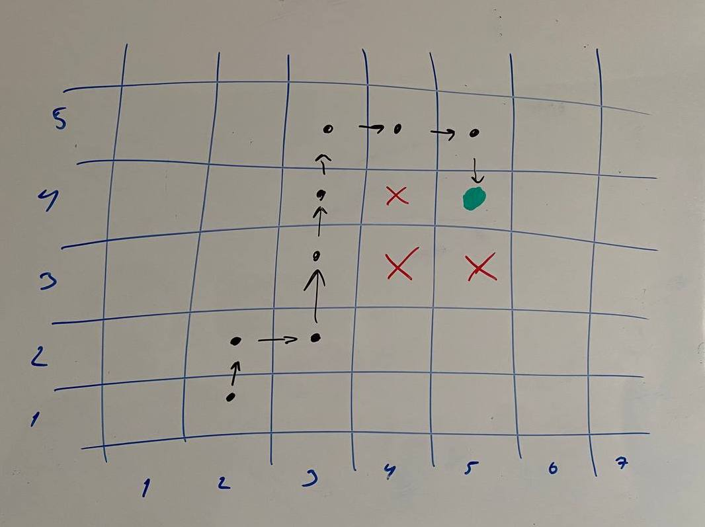

# garantex_test

`gem install rspec`  
`rspec ./tests/*`  
`ruby main.rb`  

Привет! Задача сложнее чем показалось на первый взгляд.

Я залил второй вариант своего решения.
Первый вариант (перебор всех комбинаций в лоб) страшный, сырой и медленно работет.

Данное решение пытается найти оптимальный путь, используя теорему Пифагора для сравнения доступных векторов.
Это работает для двухмерного пространства (фото), для трехмерного и (делаю вывод что) для n-мерного тоже.

Честно говоря, мне кажется существуют достаточно сложные входные данные, которые данный код не сможет корректно решить.
Например можно взять:
- максимальное количество цифр (6)
- разместить start и target максимально далеко друг от друга
- наложить максимальное количество заперещенных комбинаций, так что бы осталась единственная (и максимально длинная) цепочка решения

Что бы проверить и обработать этот кейс нужно время, а я уже и так затянул с решением =//